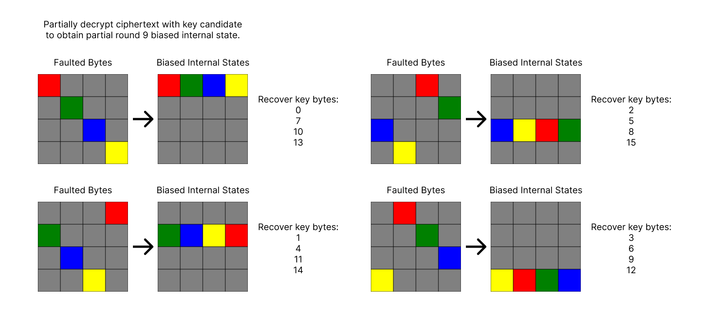

# Statistical Ineffective Fault Analysis Tools

SIFA (Statistical Ineffective Fault Analysis) is a powerful fault-injection technique used in cryptographic research. This repository contains scripts designed to experiment with SIFA-based attacks on symmetric cryptography implementations, specifically AES.  

Whether you're a cybersecurity researcher, a hardware hacker, or someone who just loves breaking crypto, these tools have you covered. Use it for learning, research, or chaotic fun.

In practice you must to dial in your faults for this to work, ie bias correct intermediate values. Side channel profiling the device first will help determining the correct location in time to fault.

## Features
- **Fault Injection Simulation** — Generate biased ineffective fault injection results according to specific fault models.
- **SIFA Attack Implementions** — Break AES with countermeasures using the original/improved attacks.
- **CLI-Based** — Fully customizable from the command line.

## Usage
```bash
pip3 install numpy matplotlib tqdm
```

Simulation script. Default uses the random-and fault. The real world Fault Distribution Table (FDT) will likely differ. Log-Likelihood Ratio (LLR) coming in future release?
```bash
python3 simaes.py -h
usage: simaes [-h] [-s SAMPLES] [-k KEY] [-r {9,10}] [-i {0,1,2,3,4,5,6,7,8,9,10,11,12,13,14,15}] [-t {rand,flip,and,zero,one}] [-b {1,2,3,4,5,6,7,8}] [-v] output

simulate AES encryption for SIFA

positional arguments:
  output                output file to store ineffective faults

options:
  -h, --help            show this help message and exit
  -s, --samples SAMPLES
                        number of samples to collect
  -k, --key KEY         default aes key is cafebabe01020304feeeeeedfaaaaace
  -r, --round {9,10}    round to inject fault into
  -i, --index {0,1,2,3,4,5,6,7,8,9,10,11,12,13,14,15}
                        which byte in the AES state to inject fault into
  -t, --type {rand,flip,and,zero,one}
                        type of fault: random, bit flip, random and, stuck at zero, stuck at one. paper section 3.1, FDT needs to produce bias
  -b, --bits {1,2,3,4,5,6,7,8}
                        bit width for fault, starts from lsb
  -v, --verbose
```
Running
```bash
python3 simaes.py cipher.bin -s 5000 -v
```

`sifa.py` has research and reference code. Python is slow, so it was abandoned for C++ implementation.
```bash
usage: sifa [-h] [-s SAMPLES] [-a {2,9,10}] [-k {0,1,2,3}] [-v] input
sifa: error: the following arguments are required: input
```

MacOS fast key search using NEON instructions and high priority threads.
```bash
make
./sifa -i cipher.bin -o output.txt -v
```



## Example
```bash
round keys
cafebabe01020304feeeeeedfaaaaace
675231936650329798bedc7a621476b4
9f6abc39f93a8eae618452d403902460
fb5c6c420266e2ec63e2b03860729458
b37e0692b118e47ed2fa5446b288c01e
67c474a5d6dc90db0426c49db6ae0483
a33698eb75ea083071ccccadc762c82e
49dea92d3c34a11d4df86db08a9aa59e
71d8a2534dec034e00146efe8a8ecb60
73c7722d3e2b71633e3f1f9db4b1d4fd
8d8f26a0b3a457c38d9b485e392a9ca3
```

```bash
./sifa -i cipher.bin -o output.txt -v -k 1
93 ineffective faults
keygroup: 1
key byte 1: 0x8f
key byte 4: 0xb3
key byte 11: 0x5e
key byte 14: 0x9c
max SEI: 0.135416
elapsed time: 288 seconds
```

## References
[SIFA: Exploiting Ineffective Fault Inductions on Symmetric Cryptography](https://eprint.iacr.org/2018/071.pdf)

[Practical Improvements to Statistical Ineffective Fault Attacks](https://eprint.iacr.org/2024/284.pdf)

## License
MIT see LICENSE.md

Not responsible if your cat learns cryptography through osmosis.
